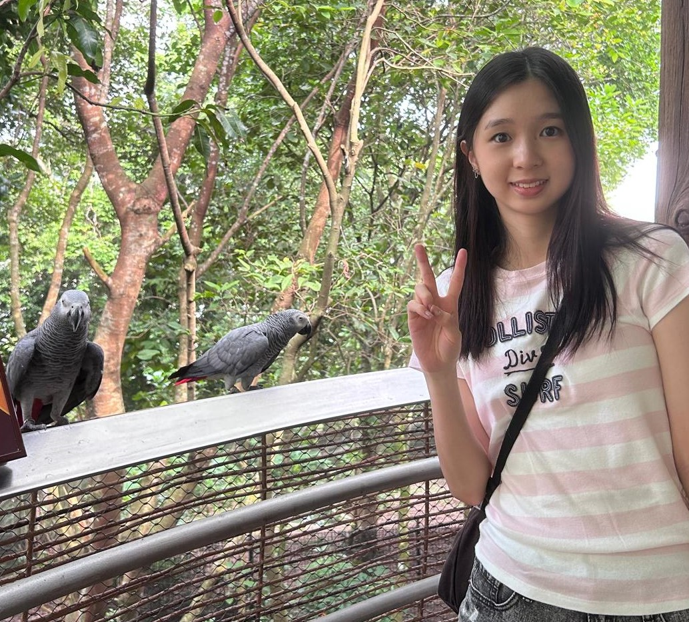
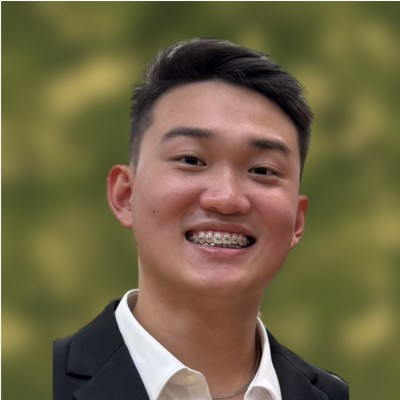
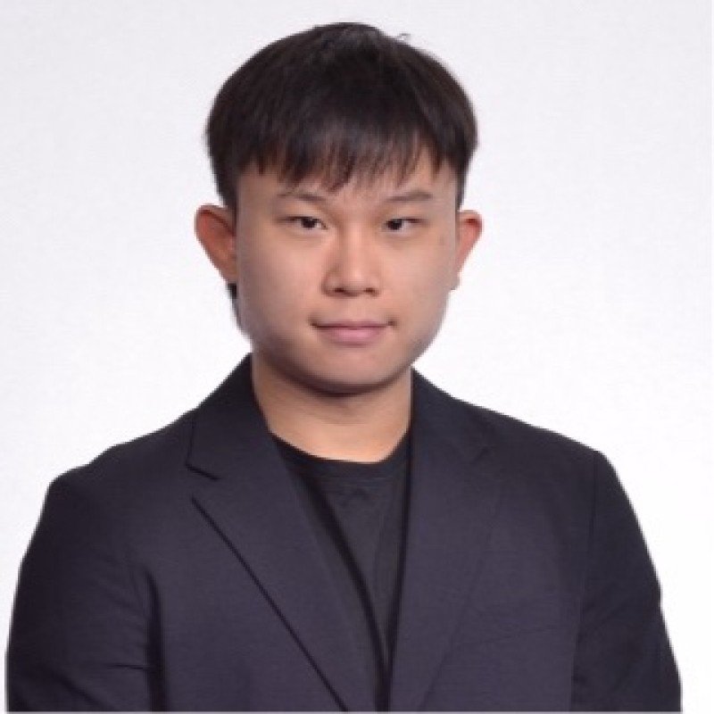
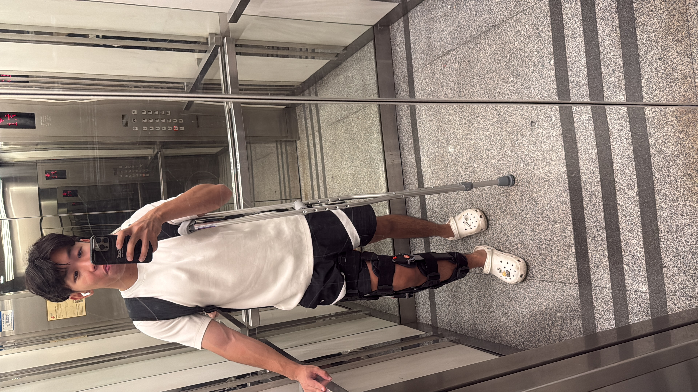

# About Us

We are a team based in the [School of Computing, National University of Singapore](http://www.comp.nus.edu.sg).

## Project team

### Kaelin Quek

[[github](https://github.com/kqjy29)]

* Role: Developer

### Tommy Quak

[[github](https://github.com/tommyquak)]

* Role: Developer
* Responsibilities: Documentation

### Kasey Ho Kei Ching

[[github](https://github.com/kaseyho)]

* Role: Developer

### Peter Bezgoubov

[[github](https://github.com/pbez02)]

* Role: Developer

### Jovan Ong

[[github](https://github.com/WatsUrProb)]

* Role: Developer
* Responsibilities: Testing and quality assurance
